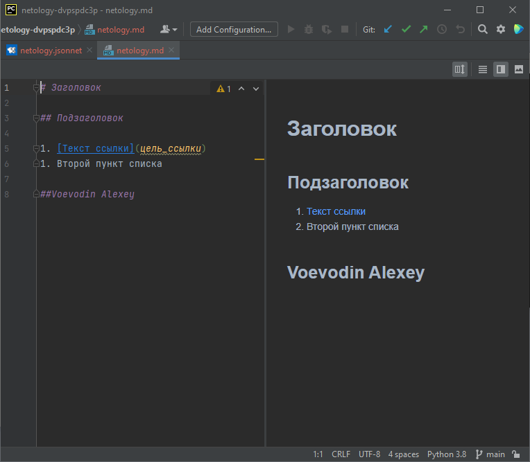

# Домашнее задание к занятию «1.1. Введение в DevOps»

## Задание №1 - Подготовка рабочей среды
1. Скриншоты по первому заданию:
    - Terraform: 
    - Bash: 
    - Markdown: 
    - Yaml: 
    - Jsonnet: 

## Задание №2- Описание жизненного цикла задачи (разработки нового функционала)
"Описание истории

Представьте, что вы работаете в стартапе, который запустил интернет-магазин. Ваш интернет-магазин достаточно успешно развивался, и вот пришло время налаживать процессы: у вас стало больше конечных клиентов, менеджеров и разработчиков. Сейчас от клиентов вам приходят задачи, связанные с разработкой нового функционала. Задач много, и все они требуют выкладки на тестовые среды, одобрения тестировщика, проверки менеджером перед показом клиенту. В случае необходимости, вам будет необходим откат изменений.
Решение задачи

Вам необходимо описать процесс решения задачи в соответствии с жизненным циклом разработки программного обеспечения. Использование какого-либо конкретного метода разработки необязательно. Для решения главное - прописать по пунктам шаги решения задачи (релизации в конечный результат) с участием менеджера, разработчика (или команды разработчиков), тестировщика (или команды тестировщиков) и себя как DevOps-инженера.

Для развития интернет магазина процесс стоит выстроить следующим образом:
- Менеджер принимает запросы от клиентов на реализацию нового функционала и обратную связь по уже имеющемуся. После обсуждения с руководителем разработки формируются технические задания, сроки реализации, определяются необходимые для выполнения сотрудники и ПО/железо. Техзадание сроки согласуются с заказчиком/руководсвом.
- Инженер devops и руководитель разработки опредеяют архитектуру приложения, возможные отличия работы приложения в тестовых средах и на продакшен серверах (могут различаться имена доменов, пути до файлов, адреса серверов баз данных, доступы к сторонним api, нужно выработать алгоритм переноса новых разработок из теста в продакшн.(В идеале перенести скрипты и поправить один конфиг при необходимости))
- Инженер devops дает рекомендации по подбору оборудования исходя из имеющихся данных мониторинга нагрузки (если требуется увеличить мощности) и настраивает систему контроля версий и тестовое окружение (скорее всего не одно). 
- Разработчики приступают к реализации задач по техзаданию на тестовом окружении, по завершении отдают в тестирование, исправляют возможные ошибки. 
- После успешного прохождения тестирования, новый функционал через менеджера предъявляется заказчику и идет на продакшн.
- В процессе разработки инженер devops занимается технической поддержкой разработчиков в случае возникновения вопросов по конфигурациям тестовой и продакшн среды, использования системы контроля версий и тд. Так же решает вопросы автоматизации деплоя кода в тестовую среду, установки нового ПО и систем на серверах, резервного копирования и отката изменений, а так же разграничения доступа и другие связанные с эксплуатацией. 
- После отправки задачи в тестирование и затем в продакшн, разработчикам необходимо так же документировать изменения, а devops уделить внимание мониторингу и эксплуатации. 
- Данный цикл разработки повторять по мере появления новых запросов и задач. 
##Voevodin Alexey